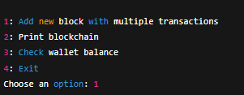
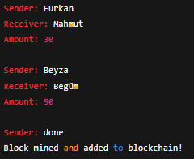
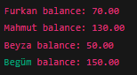

# Interactive Blockchain in Go

## 🌐 English Version

### Description
This is a simple interactive blockchain project written in Go.  
It supports multiple transactions, wallet management, proof-of-work mining, and dynamic wallet creation.  
Designed for beginner-level blockchain demonstration and learning purposes.

### Features
- Multiple wallets (default: Furkan, Begüm, Mahmut, Beyza)  
- Dynamic wallet creation for new users  
- Multiple transactions per block  
- Proof-of-Work mining  
- Blockchain validation  
- Check wallet balance  
- Interactive command-line interface (CLI)

### Installation
1. Make sure you have [Go](https://golang.org/dl/) installed (version 1.20+ recommended)  
2. Clone the repository:  
   ```bash
git clone https://github.com/Furkan-Ozbayrak/Blockchain-Go.git
cd Blockchain-Go


Run the program:

go run blockchain.go

<h4>Usage</h4>
<p float="left">
  
</p>

<h4>Example Transactions</h4>
<p float="left">
  

</p>

<h4>Print Blockchain </h4>
<p float="left">
  
</p>

<h4>Check Wallet Balance </h4>
<p float="left">
  


</p>

**Notes** :

Only registered or dynamically created wallets can send funds.

Proof-of-Work difficulty is set to 3 by default.

Educational project for blockchain learning and demonstration.

🇹🇷 Türkçe Versiyon
Açıklama

Bu, Go dili ile yazılmış basit bir etkileşimli blockchain projesidir.
Birden fazla işlem, cüzdan yönetimi, proof-of-work mining ve dinamik cüzdan oluşturmayı destekler.
Giriş seviyesindeki kullanıcılar için blockchain mantığını öğrenmeye yönelik tasarlanmıştır.

Özellikler

Çoklu cüzdanlar (varsayılan: Furkan, Begüm, Mahmut, Beyza)

Yeni kullanıcılar için dinamik cüzdan oluşturma

Her blokta birden fazla işlem

Proof-of-Work mining

Blockchain doğrulama

Cüzdan bakiyesini kontrol etme

Etkileşimli komut satırı arayüzü (CLI)

Kurulum

Go
 yüklü olduğundan emin olun (1.20+ önerilir)

Repoyu klonlayın:

 git clone https://github.com/Furkan-Ozbayrak/Blockchain-Go.git
cd Blockchain-Go


Programı çalıştırın:

cd Blockchain-Go

<h4>Kullanım</h4>
<p float="left">
  
</p>

<h4>Örnek İşlemler</h4>
<p float="left">
  

</p>

<h4>Blockchain’i Yazdırma </h4>
<p float="left">
  
</p>

<h4>Cüzdan Bakiyesini Kontrol Etme </h4>
<p float="left">
  


</p>


**Notes** :

Yalnızca kayıtlı veya dinamik olarak oluşturulan cüzdanlar para gönderebilir.

Proof-of-Work zorluğu varsayılan olarak 3’tür.

Blockchain öğrenimi ve demo amaçlı eğitim projesidir.
